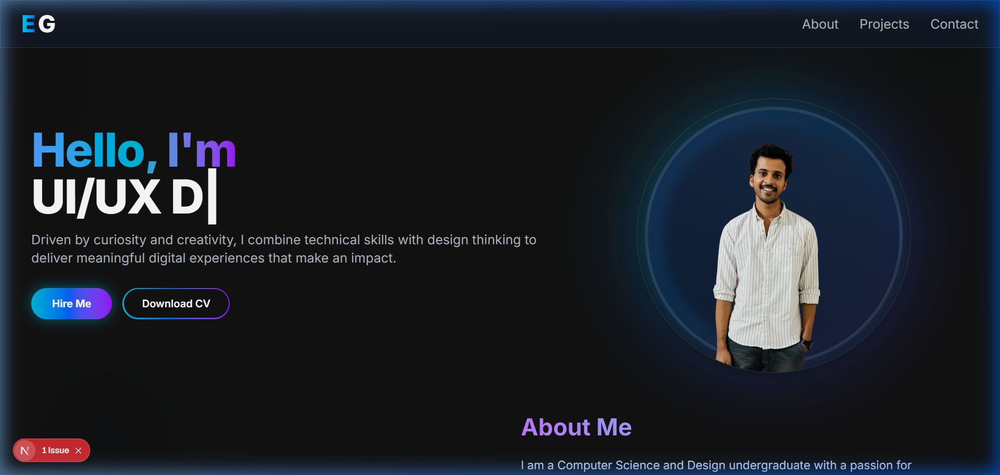
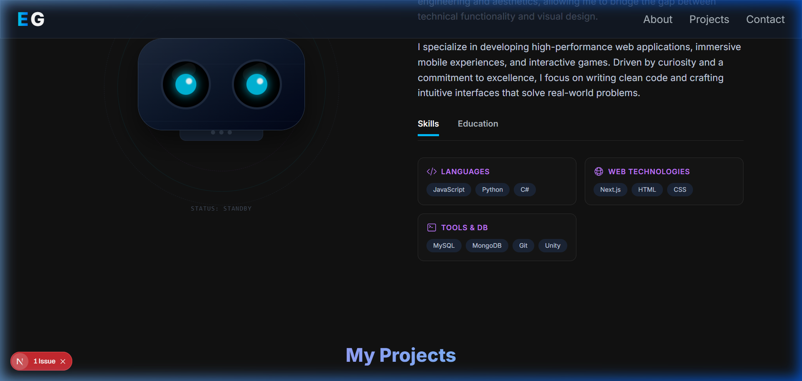
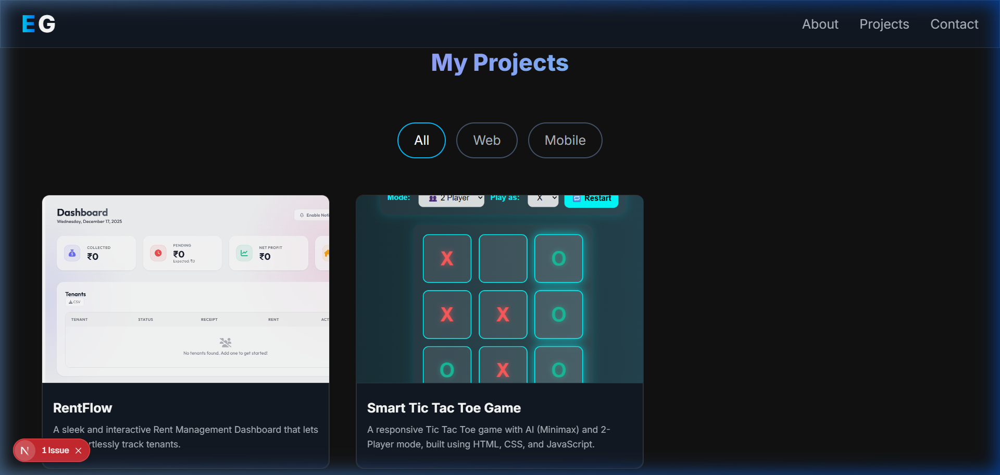

<h1 align="center">
  <br>
  🚀 Eldhose George - Personal Portfolio
  <br>
</h1>

<h4 align="center">A high-performance modern portfolio built using Next.js, Three.js, and Framer Motion.</h4>

<p align="center">
  <a href="#about">About</a> •
  <a href="#screenshots">Screenshots</a> •
  <a href="#technologies-used">Technologies Used</a> •
  <a href="#features">Features</a> •
  <a href="#getting-started">Getting Started</a>
</p>

---

## 🌟 About

Welcome to the source code of my personal developer portfolio! This site is designed to highlight my skills, display my recent work, and allow potential collaborators or employers to effortlessly reach out to me. Focused heavily on 3D animations and fluid styling, this portfolio aims to provide an immersive layout for visitors.

## 📸 Screenshots

### The Hero Section
*Fully animated 3D objects rendering beautifully alongside typing effects.*


### My Projects Overview
*A deep dive into some of my most impactful latest builds like the 'RentFlow' ecosystem.*


### Projects & Details
*Cards that seamlessly adapt and scale while you scroll.*


## 💻 Technologies Used

This project harnesses the power of modern web technologies to create a seamlessly integrated and performant experience:

- **Next.js 15 (Turbopack):** Core React architecture and routing.
- **Three.js & React Three Fiber/Drei:** Rendering rich, interactive 3D assets directly in the browser.
- **Tailwind CSS:** Fully responsive, utility-first styling for rapid UI development.
- **Framer Motion:** Powerful production-ready animations.
- **React Type Animation / Animated Numbers:** For engaging micro-interactions on the frontend.
- **EmailJS / Resend:** Ensuring emails are securely formatted and dispatched right from the browser.

## ✨ Features

- **Interactive 3D Elements:** Engaging hero section leveraging `three.js`.
- **High-Performance Animations:** Smooth scrolling dynamics with zero layout shifts.
- **Project Showcase Library:** A completely responsive grid to detail past case studies.
- **Interactive Contact Form:** Instant message delivery integration directly to my inbox.
- **Optimized Assets:** Extremely fast render times facilitated by Next.js edge caching and Image optimization.
- **Fully Responsive:** Beautifully adapts from standard ultra-wide monitors down to standard smartphone screens.

## 🚀 Getting Started

If you want to view the codebase or experiment with the styles locally:

### Prerequisites

Ensure you have **Node.js** (v18+) and your preferred package manager (npm, yarn, pnpm) installed.

### Installation

1. **Clone the repository:**
   ```bash
   git clone https://github.com/eldhosegeorge2004/Portfolio_Eldhose.git
   ```

2. **Navigate to the directory:**
   ```bash
   cd Portfolio_Eldhose
   ```

3. **Install dependencies:**
   ```bash
   npm install
   ```

4. **Start the development server:**
   ```bash
   npm run dev
   ```

5. **Open the App:** Navigate to [http://localhost:3000](http://localhost:3000)

---
<p align="center">
  Designed & Built by <a href="https://github.com/eldhosegeorge2004">Eldhose George</a>
</p>
